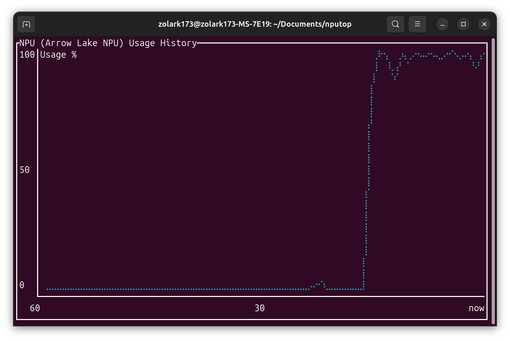

# nputop

nputop es una herramienta de monitorización basada en terminal que muestra el uso de la Unidad de Procesamiento Neural (NPU) de Intel. Inspirado en `nvtop`, ofrece una visión en tiempo real del rendimiento de la NPU, permitiendo a los usuarios supervisar eficazmente la utilización de recursos en sistemas basados en Intel.



## Instalación

Asegúrate de tener instalados Rust y Cargo en tu sistema.

Para instalar nputop, simplemente clona el repositorio y ejecuta la compilación con Cargo:

```shell
# Clonar el repositorio
git clone https://github.com/ZoLArk173/nputop.git

# Acceder al directorio del proyecto
cd nputop

# Compilar e instalar con Cargo
cargo install --path .
```

## Uso

Ejecuta nputop desde la terminal:

```shell
nputop
```

Presiona `q` para salir de la aplicación.

## Contribución

¡Las contribuciones son bienvenidas! Si encuentras algún error o tienes una idea para una nueva función, no dudes en abrir un issue o enviar una pull request.

1. Haz un fork del repositorio.
2. Crea una nueva rama (`git checkout -b feature-branch`).
3. Commit los cambios (`git commit -m 'Add some feature'`).
4. Sube los cambios a la rama (`git push origin feature-branch`).
5. Abre una pull request.

## Licencia

Este proyecto está licenciado bajo la Licencia MIT. Consulta el archivo `LICENSE` para más detalles.

## Agradecimientos

- Inspirado en el fantástico proyecto `nvtop`.
- Agradecemos a la comunidad de Rust por su apoyo y herramientas.

## Contacto

Si tienes alguna pregunta, no dudes en contactarme o abrir un issue en el repositorio.
