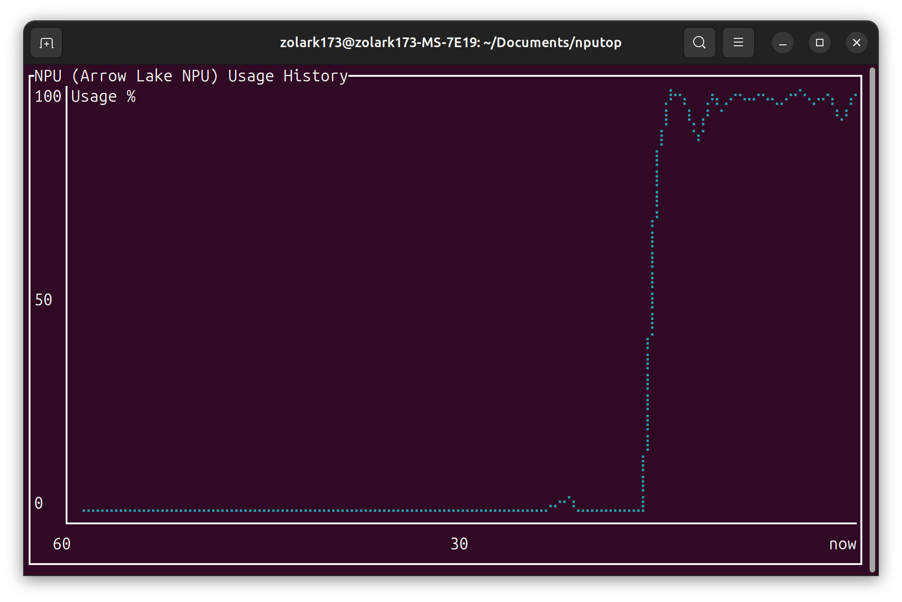

# nputop

nputop is a terminal-based monitoring tool that displays Intel Neural Processing Unit (NPU) usage. Inspired by `nvtop`, it provides a similar real-time view of NPU performance, allowing users to monitor resource utilization on Intel-based systems effectively.



## Installation

Ensure you have `rust` and `cargo` installed on your system.

To install `nputop`, simply clone the repository and build it using Cargo:

```shell
# Clone the repository
git clone https://github.com/ZoLArk173/nputop.git

# Navigate to the project directory
cd nputop

# Build and install with Cargo
cargo install --path .
```

## Usage

Run `nputop` directory from your terminal:

```shell
nputop
```

Press `q` to quit the application.

## Contributing

Contributions are welcome! If you find a bug or have an idea for a new feature, feel free to open an issue or submit a pull request.

1. Fork the repository.
2. Create a new branch (`git checkout -b feature-branch`).
3. Commit your changes (`git commit -m 'Add some feature'`).
4. Push to the branch (`git push origin feature-branch`).
5. Open a pull request.

## License

This project is licensed under the MIT License - see the `LICENSE` file for details.

## Acknowledgments

- Inspired by the amazing `nvtop` project.
- Thanks to the Rust community for their support and tools.

## Contact

For any inquiries, feel free to reach out or open an issue in the repository.
